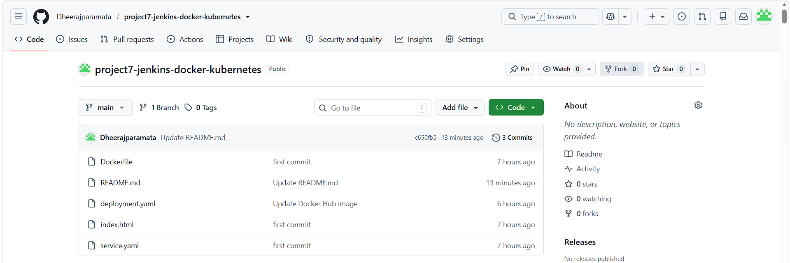
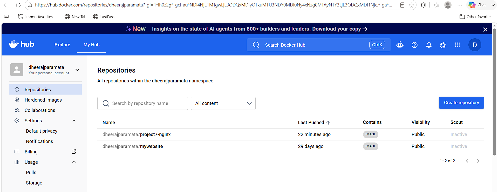
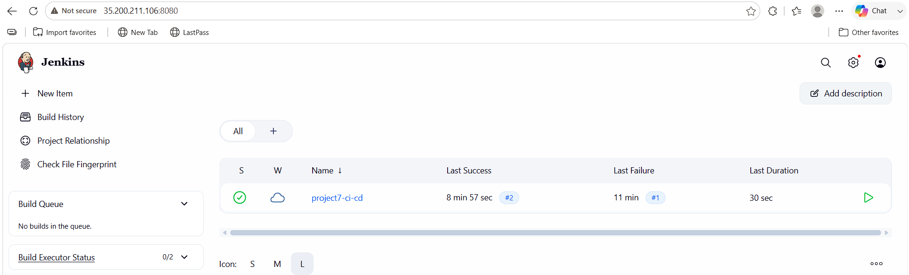
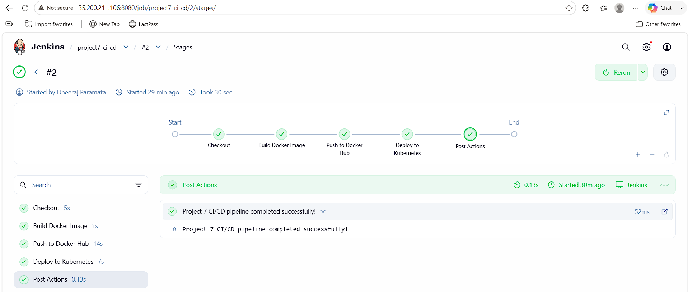
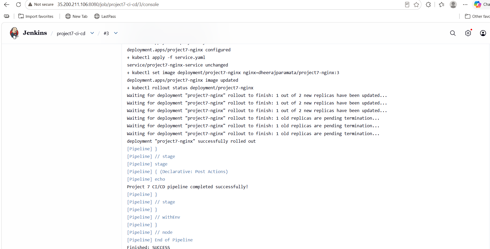
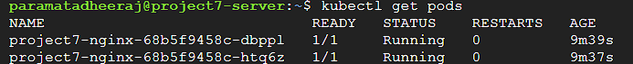
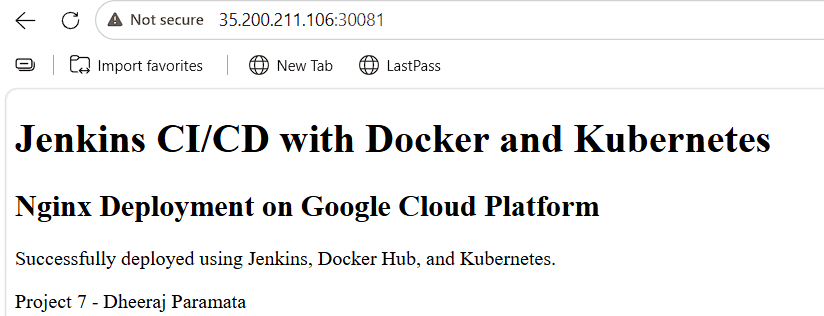

# Project 7 - Jenkins CI/CD with Docker Hub and Kubernetes

## Overview

This project demonstrates a complete CI/CD pipeline using GitHub, Jenkins, Docker, Docker Hub, Kubernetes, and Nginx on Google Cloud Platform.

The application is developed as a simple Nginx web application. Jenkins automatically checks out the source code from GitHub, builds the Docker image, pushes the image to Docker Hub, and deploys the new image to a Kubernetes cluster.

The project demonstrates continuous integration and continuous deployment using a real containerized application.

## Architecture

```text
                    Developer
                        |
                        v
                    GitHub
                        |
                        v
                    Jenkins
                        |
             +----------+----------+
             |                     |
             v                     v
        Docker Build         Pipeline Stages
             |
             v
        Docker Hub
             |
             v
       Kubernetes / k3s
             |
       +-----+-----+
       |           |
       v           v
   Nginx Pod    Nginx Pod
       |           |
       +-----+-----+
             |
             v
        NodePort 30081
             |
             v
          Browser
```

## CI/CD Workflow

```text
GitHub
   |
   v
Jenkins Checkout
   |
   v
Docker Image Build
   |
   v
Docker Hub
   |
   v
Kubernetes Deployment
   |
   v
Rolling Update
   |
   v
Nginx Application
   |
   v
Browser
```

## Technologies Used

* Google Cloud Platform
* Debian 12
* Git
* GitHub
* Jenkins 2.568.2
* Java 21
* Docker 20.10.24
* Docker Hub
* Kubernetes
* k3s
* kubectl
* Nginx
* HTML

## Project Environment

### Google Cloud VM

```text
VM Name: project7-server
Zone: asia-south1-b
Machine Type: e2-medium
Operating System: Debian 12
External IP: 35.200.211.106
```

### Kubernetes

```text
Distribution: k3s
Kubernetes Version: v1.36.3+k3s1
Node: project7-server
Replicas: 2
Service Type: NodePort
NodePort: 30081
```

## Project Structure

```text
project7-jenkins-docker-kubernetes/
│
├── Dockerfile
├── Jenkinsfile
├── deployment.yaml
├── service.yaml
├── index.html
├── README.md
└── screenshots/
```

## Application

The application is a simple HTML page served using Nginx.

The page displays:

```text
Jenkins CI/CD with Docker and Kubernetes

Nginx Deployment on Google Cloud Platform

Successfully deployed using Jenkins, Docker Hub, and Kubernetes.

Project 7 - Dheeraj Paramata
```

## Dockerfile

```dockerfile
FROM nginx:latest

COPY index.html /usr/share/nginx/html/index.html

EXPOSE 80
```

### Dockerfile explanation

* Uses the official Nginx image.
* Copies `index.html` into the Nginx web root.
* Exposes port 80.

## Docker Image

The Docker image is stored in Docker Hub:

```text
dheerajparamata/project7-nginx
```

The Jenkins pipeline creates two tags:

```text
dheerajparamata/project7-nginx:<BUILD_NUMBER>
dheerajparamata/project7-nginx:latest
```

Example:

```text
dheerajparamata/project7-nginx:2
```

## Kubernetes Deployment

The deployment runs two Nginx replicas.

```yaml
apiVersion: apps/v1
kind: Deployment
metadata:
  name: project7-nginx
spec:
  replicas: 2
  selector:
    matchLabels:
      app: project7-nginx
  template:
    metadata:
      labels:
        app: project7-nginx
    spec:
      containers:
        - name: nginx
          image: dheerajparamata/project7-nginx:latest
          ports:
            - containerPort: 80
```

### Deployment details

```text
Deployment Name: project7-nginx
Replicas: 2
Container: nginx
Container Port: 80
```

## Kubernetes Service

The Nginx application is exposed using a NodePort service.

```yaml
apiVersion: v1
kind: Service
metadata:
  name: project7-nginx-service
spec:
  type: NodePort
  selector:
    app: project7-nginx
  ports:
    - port: 80
      targetPort: 80
      nodePort: 30081
```

### Service details

```text
Service Name: project7-nginx-service
Type: NodePort
Port: 80
Target Port: 80
NodePort: 30081
```

## Jenkins Pipeline

The Jenkins pipeline performs four main stages:

1. Checkout source code from GitHub
2. Build the Docker image
3. Push the image to Docker Hub
4. Deploy the image to Kubernetes

The deployment uses the Jenkins build number as the image tag.

Example:

```text
Build #2
      |
      v
dheerajparamata/project7-nginx:2
      |
      v
Kubernetes rolling update
```

## Jenkins Pipeline Stages

### Stage 1 - Checkout

Jenkins checks out the latest code from the main branch.

```text
GitHub Repository
        |
        v
Jenkins Workspace
```

### Stage 2 - Build Docker Image

Jenkins runs:

```bash
docker build -t dheerajparamata/project7-nginx:$BUILD_NUMBER \
             -t dheerajparamata/project7-nginx:latest .
```

### Stage 3 - Push to Docker Hub

Jenkins logs into Docker Hub using a stored Jenkins credential and pushes:

```text
dheerajparamata/project7-nginx:<BUILD_NUMBER>
dheerajparamata/project7-nginx:latest
```

The Docker Hub credential is stored in Jenkins as:

```text
dockerhub-credentials
```

No password or access token is stored in this repository.

### Stage 4 - Deploy to Kubernetes

Jenkins runs:

```bash
kubectl apply -f deployment.yaml
kubectl apply -f service.yaml

kubectl set image deployment/project7-nginx \
  nginx=dheerajparamata/project7-nginx:$BUILD_NUMBER

kubectl rollout status deployment/project7-nginx
```

This performs a Kubernetes rolling update.

## Jenkinsfile

The pipeline can be stored as a `Jenkinsfile` in the GitHub repository.

```groovy
pipeline {
    agent any

    environment {
        IMAGE = "dheerajparamata/project7-nginx"
        KUBECONFIG = "/var/lib/jenkins/.kube/config"
    }

    stages {

        stage('Checkout') {
            steps {
                git branch: 'main',
                    url: 'https://github.com/Dheerajparamata/project7-jenkins-docker-kubernetes.git'
            }
        }

        stage('Build Docker Image') {
            steps {
                sh '''
                    docker build \
                    -t $IMAGE:$BUILD_NUMBER \
                    -t $IMAGE:latest \
                    .
                '''
            }
        }

        stage('Push to Docker Hub') {
            steps {
                withCredentials([
                    usernamePassword(
                        credentialsId: 'dockerhub-credentials',
                        usernameVariable: 'DOCKER_USER',
                        passwordVariable: 'DOCKER_PASS'
                    )
                ]) {
                    sh '''
                        echo "$DOCKER_PASS" | docker login \
                            -u "$DOCKER_USER" \
                            --password-stdin

                        docker push $IMAGE:$BUILD_NUMBER
                        docker push $IMAGE:latest

                        docker logout
                    '''
                }
            }
        }

        stage('Deploy to Kubernetes') {
            steps {
                sh '''
                    kubectl apply -f deployment.yaml
                    kubectl apply -f service.yaml

                    kubectl set image deployment/project7-nginx \
                        nginx=$IMAGE:$BUILD_NUMBER

                    kubectl rollout status deployment/project7-nginx
                '''
            }
        }
    }

    post {
        success {
            echo 'Project 7 CI/CD pipeline completed successfully!'
        }

        failure {
            echo 'Project 7 CI/CD pipeline failed.'
        }
    }
}
```

## Kubernetes Setup

Install k3s:

```bash
curl -sfL https://get.k3s.io | sh -
```

Check the node:

```bash
sudo k3s kubectl get nodes
```

Configure the user's Kubernetes configuration:

```bash
mkdir -p ~/.kube
sudo cp /etc/rancher/k3s/k3s.yaml ~/.kube/config
sudo chown $USER:$USER ~/.kube/config
export KUBECONFIG=$HOME/.kube/config
```

Make the configuration permanent:

```bash
echo 'export KUBECONFIG=$HOME/.kube/config' >> ~/.bashrc
source ~/.bashrc
```

Verify:

```bash
kubectl get nodes
```

Expected:

```text
NAME              STATUS   ROLES           VERSION
project7-server   Ready    control-plane   v1.36.3+k3s1
```

## Manual Kubernetes Deployment

Apply the deployment:

```bash
kubectl apply -f deployment.yaml
```

Apply the service:

```bash
kubectl apply -f service.yaml
```

Check the pods:

```bash
kubectl get pods -o wide
```

Check the service:

```bash
kubectl get svc
```

Check the rollout:

```bash
kubectl rollout status deployment/project7-nginx
```

## Example Kubernetes Result

```text
project7-nginx-xxxxxxxxx-xxxxx   1/1   Running
project7-nginx-xxxxxxxxx-xxxxx   1/1   Running
```

Service:

```text
project7-nginx-service   NodePort   80:30081/TCP
```

## Jenkins Configuration

Jenkins was installed on the same Google Cloud VM.

Docker access was granted to Jenkins:

```bash
sudo usermod -aG docker jenkins
sudo systemctl restart jenkins
```

Docker access was verified using:

```bash
sudo -u jenkins docker --version
sudo -u jenkins docker ps
```

Kubernetes access was configured using:

```text
/var/lib/jenkins/.kube/config
```

Kubernetes access was verified using:

```bash
sudo -u jenkins \
KUBECONFIG=/var/lib/jenkins/.kube/config \
kubectl get nodes
```

## Docker Hub Configuration

Docker Hub repository:

```text
dheerajparamata/project7-nginx
```

The Jenkins credential uses a Docker Hub Personal Access Token.

The token is not stored in GitHub.

## GCP Firewall

The Kubernetes NodePort requires TCP port 30081.

Firewall configuration:

```text
Protocol: TCP
Port: 30081
Source: 0.0.0.0/0
```

Jenkins uses port 8080.

```text
Protocol: TCP
Port: 8080
```

## Application URL

The application was successfully accessed using:

```text
http://35.200.211.106:30081
```

## Successful Jenkins Build

Jenkins Build #2 completed successfully.

Important pipeline results:

```text
Checkout                    SUCCESS
Docker Image Build          SUCCESS
Docker Hub Login             SUCCESS
Docker Hub Push :2           SUCCESS
Docker Hub Push :latest      SUCCESS
Kubernetes Deployment        SUCCESS
Kubernetes Rollout           SUCCESS
```

Final Jenkins result:

```text
Finished: SUCCESS
```

## Rolling Update

During Build #2, Jenkins executed:

```bash
kubectl set image deployment/project7-nginx \
nginx=dheerajparamata/project7-nginx:2
```

Kubernetes then performed a rolling update.

Final result:

```text
deployment "project7-nginx" successfully rolled out
```

## Browser Result

The deployed Nginx page was successfully opened in a web browser through the Kubernetes NodePort.

```text
http://35.200.211.106:30081
```

The browser displayed:

```text
Jenkins CI/CD with Docker and Kubernetes

Nginx Deployment on Google Cloud Platform

Successfully deployed using Jenkins, Docker Hub, and Kubernetes.

Project 7 - Dheeraj Paramata
```

## Screenshots

### 1. GitHub Repository



### 2. Docker Hub Repository



### 3. Jenkins Dashboard



### 4. Jenkins Pipeline



### 5. Jenkins Successful Console Output



### 6. Kubernetes Pods



### 7. Kubernetes Service


### 8. Browser Output



## Verification Commands

### Check Docker

```bash
docker images
docker ps
```

### Check Docker Hub image

```bash
docker pull dheerajparamata/project7-nginx:latest
```

### Check Kubernetes node

```bash
kubectl get nodes
```

### Check Kubernetes pods

```bash
kubectl get pods
```

### Check Kubernetes service

```bash
kubectl get svc
```

### Check deployment

```bash
kubectl get deployment
```

### Check rollout

```bash
kubectl rollout status deployment/project7-nginx
```

## Troubleshooting

### Docker permission denied

Add Jenkins to the Docker group:

```bash
sudo usermod -aG docker jenkins
sudo systemctl restart jenkins
```

### kubectl permission denied

Configure the user's kubeconfig:

```bash
mkdir -p ~/.kube
sudo cp /etc/rancher/k3s/k3s.yaml ~/.kube/config
sudo chown $USER:$USER ~/.kube/config
export KUBECONFIG=$HOME/.kube/config
```

### Browser timeout

Make sure GCP allows TCP port 30081.

### Kubernetes pod not running

Check:

```bash
kubectl get pods
kubectl describe pod <pod-name>
kubectl get events
```

### Check deployment status

```bash
kubectl rollout status deployment/project7-nginx
```

## Final Result

Project 7 successfully demonstrates a complete CI/CD workflow using:

```text
GitHub
   ↓
Jenkins
   ↓
Docker
   ↓
Docker Hub
   ↓
Kubernetes / k3s
   ↓
Nginx
   ↓
Browser
```

The Jenkins pipeline automatically builds and publishes the Docker image and performs a Kubernetes rolling update.

## Learning Outcomes

This project demonstrates practical experience with:

* Git and GitHub
* Docker image creation
* Docker Hub container registry
* Jenkins CI/CD pipelines
* Jenkins credentials
* Kubernetes deployments
* Kubernetes services
* k3s cluster administration
* kubectl
* Rolling updates
* GCP firewall configuration
* Containerized Nginx deployment
* Continuous deployment

## Author

**Dheeraj Paramata**

B.Tech - Computer Science and Engineering

GitHub:

https://github.com/Dheerajparamata

Project Repository:

https://github.com/Dheerajparamata/project7-jenkins-docker-kubernetes
